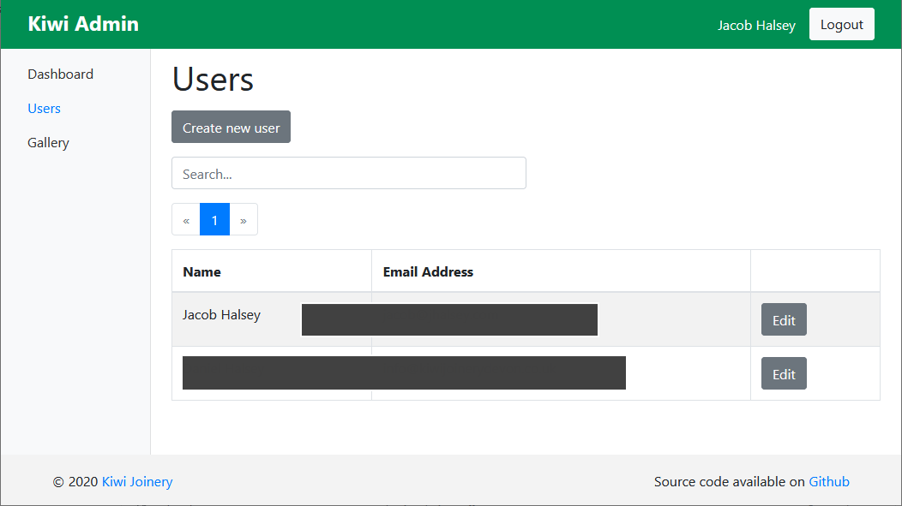
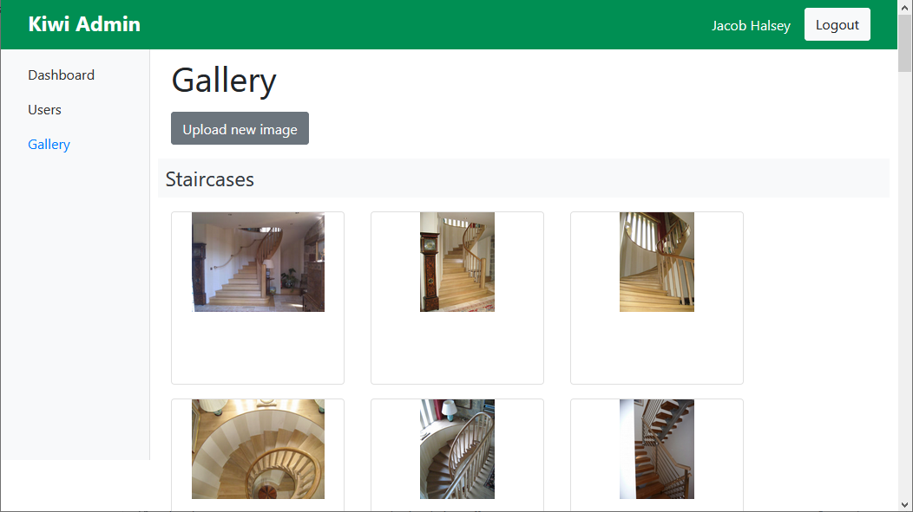

# Kiwi Admin

https://www.kiwijoinerydevon.co.uk/

Kiwi Joinery: A Brixham based manufacturer of bespoke staircases, doors, windows, cabinets, gates, and all other joinery for your needs, supplying to the Torbay and South Hams area.

This is the admin website used for managing our public website content.

## Technical

This is a single page web app (SPA) written using the Yew framework for Rust.

To build requires Rust and:
- `cargo install wasm-pack`
- `npm install --global rollup`

The script `./dev.sh` will build and host a development version locally.

## Screenshots

